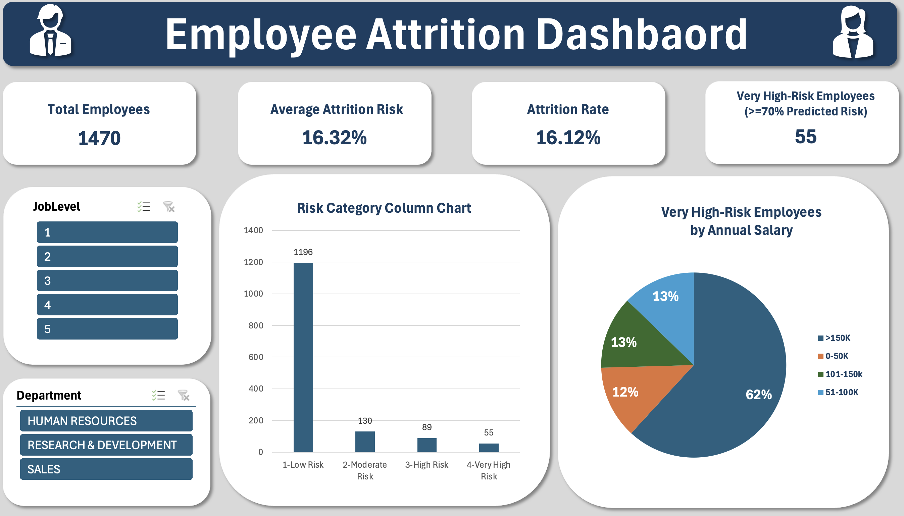

# Employee Attrition Analysis

## Project Overview

This project analyzes employee attrition using the IBM HR Analytics Employee Attrition & Performance dataset. The goal is to identify factors associated with employee attrition and develop a machine learning classification model to predict employees who may be at risk of leaving.

The project includes data cleaning, exploratory data analysis, statistical analysis, machine learning, and a custom Excel dashboard with interactive slicers and predicted attrition probabilities.

## Research Question

What factors contribute to employee attrition, and how effectively can machine learning be used to identify employees who may be at risk of leaving?

## Dataset

The project uses the IBM HR Analytics Employee Attrition & Performance dataset. The dataset contains 1,470 employee records and includes information related to compensation, job level, overtime, job satisfaction, tenure, and employee attrition.

## Project Structure

- `data/raw/` — Original employee dataset.
- `data/clean/` — Cleaned dataset for analysis and modeling.
- `data/processed/` — Dashboard dataset with predicted attrition probabilities.
- `models/` — Saved logistic regression model (`.pkl`).
- `outputs/` — Completed Excel dashboard.
- `01_data_cleaning.ipynb` — Data cleaning and preparation.
- `02_eda-visuals.ipynb` — Exploratory data analysis and visualizations.
- `03_statistical_analysis.ipynb` — Statistical analysis and hypothesis testing.
- `04_model_creation.ipynb` — Machine learning model development and evaluation.
- `functions.py` — Reusable data cleaning, model training, and dashboard preparation functions.
- `main.py` — Runs the project workflow and exports the dashboard dataset.
- `requirements.txt` — Python dependencies.

## Data Preparation

The `01_data_cleaning.ipynb` notebook contains the data cleaning and preparation process. The dataset is checked for missing values, duplicate records, data types, and constant features. Selected categorical variables are encoded for machine learning.

The cleaned dataset is saved as `data/clean/cleaned_data.csv`.

## Machine Learning

A logistic regression classification model is trained using a Scikit-learn pipeline with StandardScaler. Model performance is evaluated using ROC-AUC, accuracy, precision, recall, and F1-score.

The trained model is saved as `models/logistic_regression_model.pkl`.

## Excel Dashboard

The dashboard displays employee counts, historical attrition rates, average predicted attrition risk, and high-risk employee counts.

The dashboard uses PivotTables, PivotCharts, slicers, and Power Query to analyze employee attrition across departments, job levels, and predicted risk categories.

The dashboard source data is saved as `data/processed/dashboard_dataset.csv`.

## Tools & Python Libraries

- Python 3.11
- Pandas
- NumPy
- Statsmodels
- Scikit-learn
- PyCaret 3.3.2
- Matplotlib
- Seaborn
- Joblib
- Microsoft Excel / Power Query

## Project Status

- [x] Data cleaning and preparation
- [x] Exploratory data analysis
- [x] Statistical analysis
- [x] Data visualization
- [x] Classification model development and comparison
- [x] Final model evaluation
- [x] Save final model
- [x] Dashboard dataset generation
- [x] Finalize Excel dashboard
